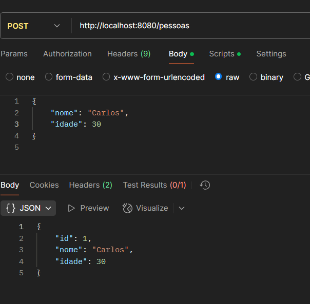
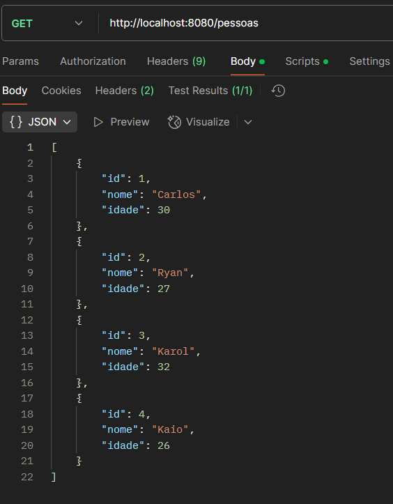
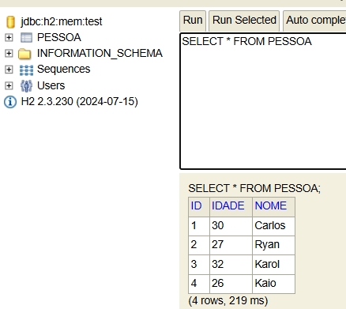
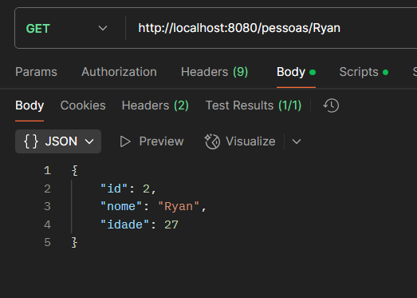
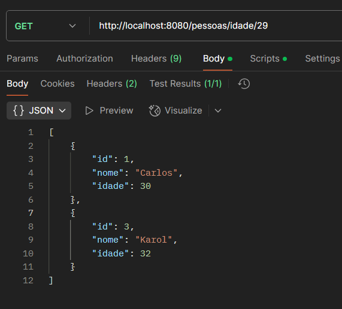

# Projeto Quarkus

Este é um projeto desenvolvido com **Quarkus**. Ele foi projetado para demonstrar como configurar e rodar uma aplicação e alguns endpoints utilizando o Quarkus com uma arquitetura simples de microsserviços.

## Pré-requisitos

- **Java 17 ou superior**: [Baixe aqui](https://www.oracle.com/java/technologies/javase-jdk11-downloads.html)
- **Maven**: [Baixe aqui](https://maven.apache.org/)

---

## Como Rodar o Projeto

### 1. Clone o Repositório

Primeiro, faça o clone do repositório para sua máquina local. No terminal, execute o comando:

```bash
git clone https://github.com/CarlosRyan07/Accenture_Summer_Academy/blob/main/Quarkus/segundapi.git
```

### 2. Rodar o Projeto❗

Para rodar o projeto originalmente me foi passado o seguinte comando:

```bash
./mvnw quarkus:dev
```

Porém quando fui rodar o projeto, o comando não funcionou❌. Então, para rodar o projeto, execute o comando:

```bash
mvn quarkus:dev
```

E assim consegui rodar o projeto✅
---

## POST

No Postman utilize a seguinte formatação para fazer um POST:

```json
{   
    "nome": "Carlos",
    "idade": 30
}

```
## POST



## GET



Get diretamente do h2.





