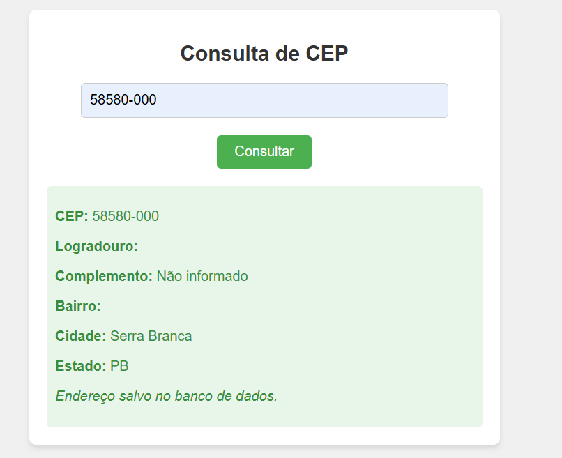
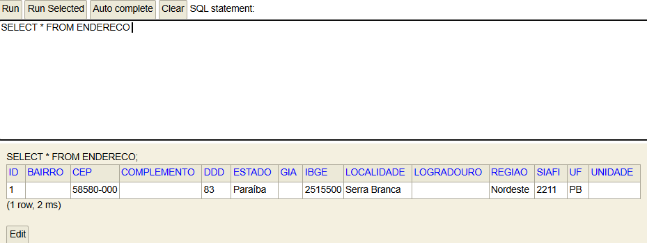

# Consulta e Gravação de CEP

Este é um dos projetos desenvolvidos dentro do programa de aprendizado de **Back-End** da **Accenture**. Ele tem como objetivo demonstrar a integração entre uma aplicação web simples, um serviço de API pública (ViaCEP) e um banco de dados H2.

## 🚀 Funcionalidades

- **Consulta de CEP**: Realiza a busca de informações de endereço com base no CEP fornecido pelo usuário, utilizando a API ViaCEP.
- **Gravação no Banco de Dados**: Armazena os dados do endereço consultado em um banco de dados H2.
- **Mensagens de Feedback**: Exibe notificações indicando o sucesso ou a falha durante a consulta do CEP.

## 🛠️ Tecnologias Utilizadas

- **Backend**:
  - Java
  - Spring Boot (Spring Web, Spring Data JPA)
  - API ViaCEP
- **Frontend**:
  - HTML
  - CSS
  - JavaScript
- **Banco de Dados**:
  - H2 Database


## 📦 Como Rodar o Projeto

### Pré-requisitos

- Java 11 ou superior 

### Passo a Passo

1. **Clone o Repositório**:

   ```bash
   git clone https://github.com/CarlosRyan07/Accenture_Summer_Academy.git
   ```

### Aplicação

Após rodar a aplicação, para interagir com a interface abra o arquivo [index.html](src\main\resources\templates\index.html) e acesse o endereço `http://localhost:8080/h2-console/` no seu navegador.

## 📷 Imagens

### Consulta de CEP



### H2



